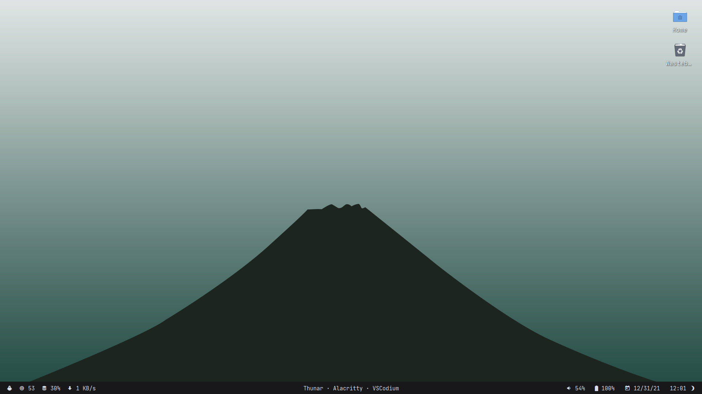
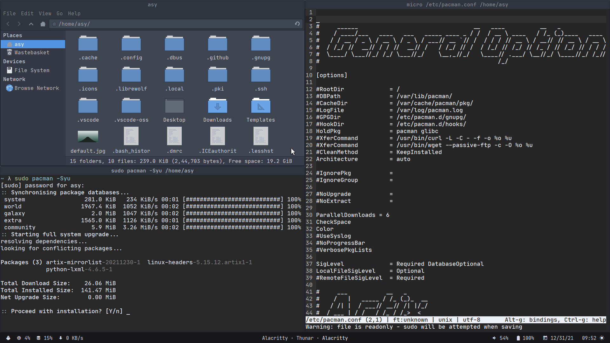
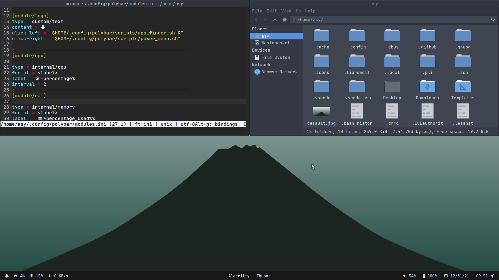

## Dotfiles 
###### ( work in progress do not use )

`Installation`
```
$ git clone https://github.com/asy-init/dotfiles

$ cd dotfiles

$ chmod u+x ./scripts

$ sh ./scripts/launch.sh
```
or 
```
git clone https://github.com/asy-init/dotfiles;cd dotfiles;chdmod u+x ./scripts;sh ./scripts/launch.sh
```
`Preview`





`Info:` 

`Sys Info:`
| Item      | Value         |
|---------	|-------------	|
| Distro  	| Artix Linux 	|
| Kernel  	| Zen Kernel  	|
| Init    	| Openrc      	|
| Display 	| Xorg        	|
| Login   	| None        	|

`Text Editors & Shells:`

| Item                  | Value                                 |
|-----------------------|---------------------------------------|
|  Text <br>Editors 	| vscode,codium,micro<br>    & leafpad 	|
| shells            	| dash , bash & fish                   	|

`Desktop Environment:`

| Item 	| value    	|
|-----	|---------	|
| wm  	| xfwm4   	|
| de  	| xfce4   	|
| bar 	| polybar 	|

`Main Apps:`

| Item     	| Value                	|
|----------	|---------------------	|
| Terminal 	| alacritty-ligatures 	|
| Files    	| Thunar              	|
| Archiver 	| Xarchiver           	|
| Browser  	| Librewolf           	|
| Photos   	| Pinta               	|
| Music    	| Spotify             	|

`Ricing:`

| Item              | Value              	|
|------------------	|----------------------	|
|  GTK<br>icons    	| Arc-Icons            	|
|  GTK<br>theme    	| Arc-Dark             	|
| Colour<br>Scheme 	| Nord &<br>Monochrome 	|

`Keyboard Shortcuts:`

`Apps / Programs:`

| function    	| shortcut             	|
|-------------	|----------------------	|
| terminal    	| `ctrl` + `alt` + `t` 	|
| files       	| `Super` + `e`        	|
| appfinder   	| `Super` + `r`        	|
| screenshots 	| `prt sc`             	|

`Window Manager:`

| function                    	| shortcut             	|
|-----------------------------	|----------------------	|
| Maximise <br>Window         	| `alt` + `m`          	|
| Hide<br>Window              	| `alt` + `h`          	|
| Rezise<br>Window            	| `alt` + `r`          	|
| Close<br>Window             	| `alt` + `F4`         	|
| Cycle<br>Window             	| `alt` + `tab`        	|
| Tile<br>Window Up           	| `Super` + `↑`        	|
| Tile<br>Window Down         	| `Super` + `↓`        	|
| Tile<br>Window Right        	| `Super` + `→`        	|
| Tile<br>Window Left         	| `Super` + `←`        	|
| Tile<br>Window Top-Left     	| `Super` + `m`        	|
| Tile<br>Window Top-Right    	| `Super` + `,`        	|
| Tile<br>Window Bottom-Left  	| `Super` + `.`        	|
| Tile<br>Window Bottom-Right 	| `Super` + `/`        	|
| Show Desktop                	| `Ctrl` + `Alt` + `D` 	|
